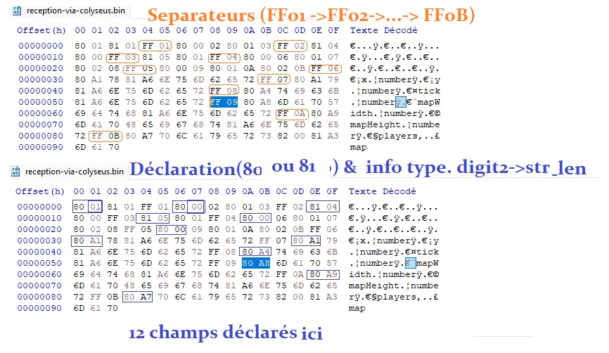

# colyseus.py-prototype

In this repo you will find my own study of the colyseus state sync mechanism, 
the motivation being an attempt to use ws to create a new SDK that brings interoperability
between python &amp; Colyseus.

For most people the repo won't be useful as this is way too experimental.
However, you can learn with me if you wish to.

Such a project can be viewed as the first step to possibly expand the following list:
[List of all multiplayer SDKs tied to Colyseus](https://github.com/orgs/colyseus/repositories?q=SDK)


## Getting started

- to perform online analysis, in general `npm install` followed by `npm run start` is enough.

Using online analysis and connecting to the Colyseus server using
websocket you can get raw data, as shown below:



That message/raw data collected from a websocket connection is based upon this data
format declaration:

```typescript
// file originally named "MyRoomState.ts"

import { Schema, Context, type, MapSchema } from "@colyseus/schema";

export interface InputData {
  left: false;
  right: false;
  up: false;
  down: false;
  tick: number;
}

export class Player extends Schema {
  @type("number") x: number;
  @type("number") y: number;
  @type("number") tick: number;

  inputQueue: InputData[] = [];
}

export class MyRoomState extends Schema {
  @type("number") mapWidth: number;
  @type("number") mapHeight: number;

  @type({ map: Player }) players = new MapSchema<Player>();
}
```

The serializer used by Colyseus is named "schema".
See [This repo](https://github.com/colyseus/schema) from Colyseus author.


## Ideas to consider

- use only `msgpack` with this NodeJS tool: ` "msgpackr": ^1.9.1` as @colyseus/core still relies
on it
- use an ancient version to avoid the "schema" serializer for easier prototyping using py
- fork the current ColyseusJS and modify it to use plain JS objects for state synchronization
- use a schema generator for py that produces dataclasses only
- use JSON-Patch instead of schema, similar to what has been done in older versions of Colyseus.


## Writing the de-serializer

- parse primitive types:<br>
https://github.com/colyseus/schema/blob/master/decoders/cpp/schema.h#L703


## Useful links

- https://github.com/Starcounter-Jack/JSON-Patch/

Old releases of Colyseus:
- https://github.com/colyseus/colyseus/releases?page=2 <br>
I don't know at what point the "schema" serializer has been introducted

Alternatives to the schema serializer:
- https://www.npmjs.com/package/msgpackr
